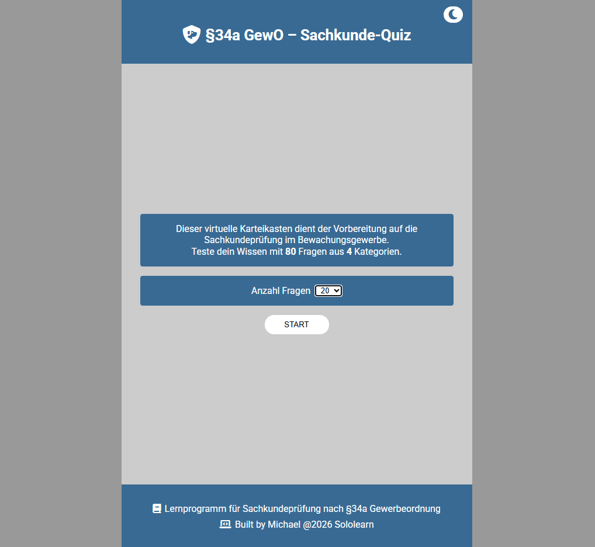
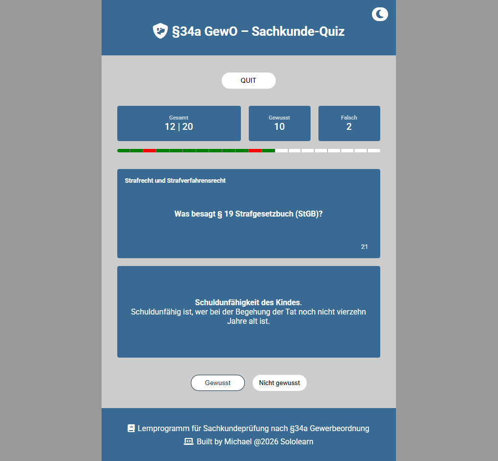
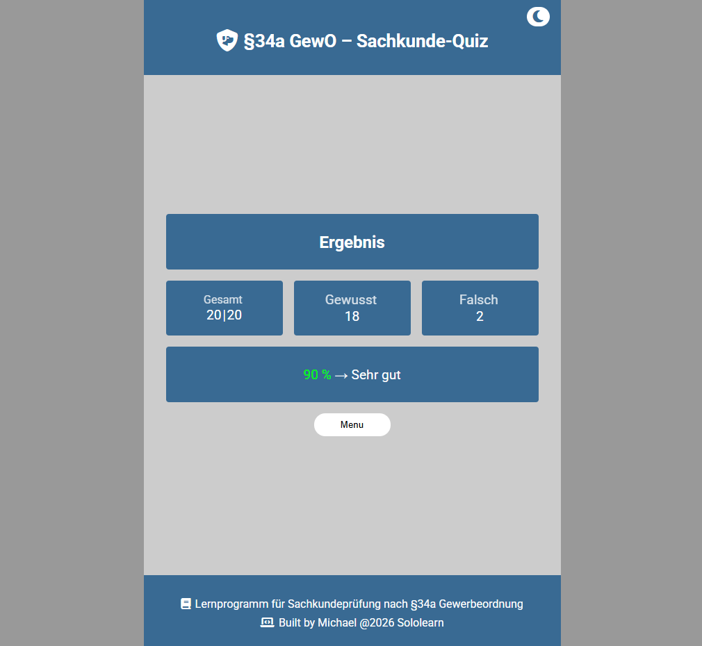
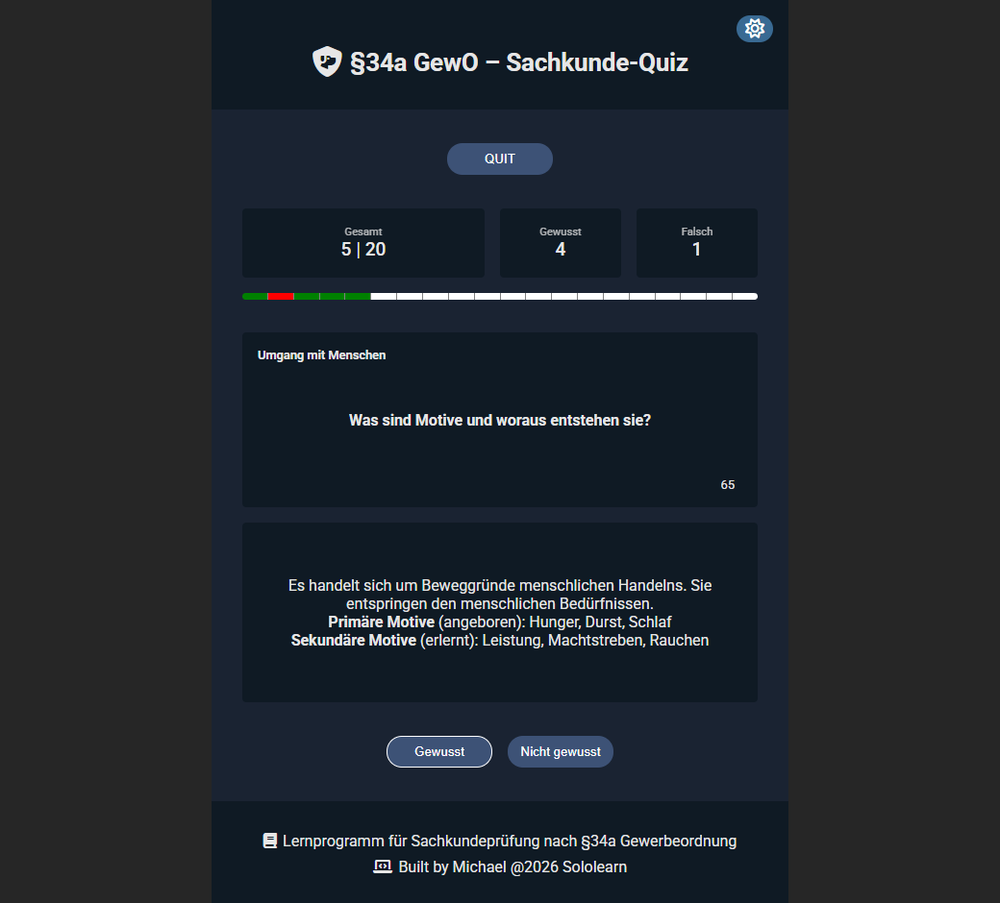

# gewo-sachkunde-quiz

Interactive Quiz for Sachkundeprüfung §34a GewO (Sololearn Code Bits)

## 🖥️ Live Demo

[Play Quiz](https://mightycharm.github.io/gewo-sachkunde-quiz/)

## 📸 Screenshots

## ℹ️ Description

- Flashcard Trainer for German Security Guard certification exam.

## ✅ Features

- Randomized Question Order
- Question count selection
- Self-assessment: Gewusst/Falsch
- Progress bar
- Stats showing during game
- Percentage rating at end screen
- Currently 80 questions across 4 categories
- Light / Dark Theme

## ⚙️ Tech Stack

  
  
  

