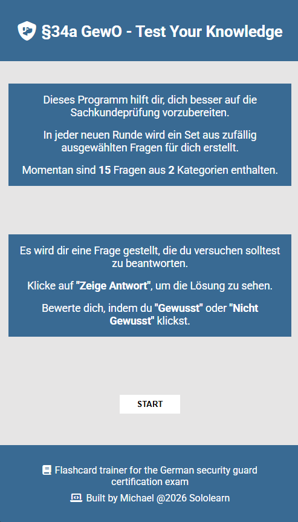
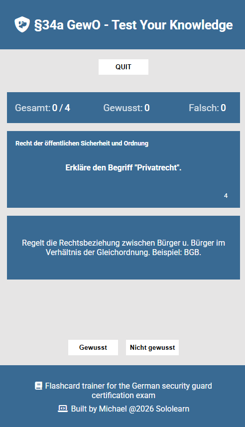

# gewo-sachkunde-quiz

Interactive Quiz for Sachkundeprüfung §34a GewO (Sololearn Code Bits)

## 🖥️ Live Demo

[Play Demo](https://mightycharm.github.io/gewo-sachkunde-quiz/)

## 📸 Screenshots

## ℹ️ Description

- Flashcard Trainer for German Security Guard certification exam.

## ✅ Features

- Randomized Question Order
- Self-assessment: Gewusst/Falsch
- Stats during game
- At the moment 15 questions across 2 categories

## ⚙️ Tech Stack

  
  
  

